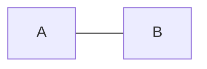
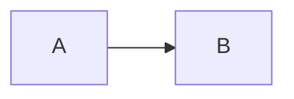
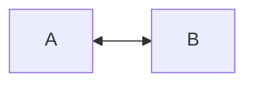
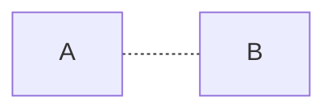
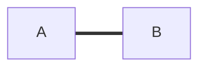
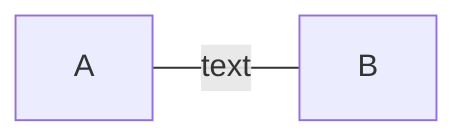
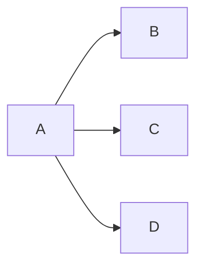
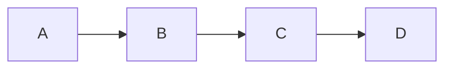

# Documentation - Mermaid - Flowcharts - Arrows
[[Flowcharts]](./README.md) | [[Home]](/README.md)

Flowcharts can have various types of arrows and connections:

## Connection Types

### Undirected Arrow

### Directed Arrow

### Bi-directional

## Line Styles

### Dotted Line

### Thick Line

## Text Labels

### Line with Text

## Complex Connections

### Multiple Arrows from One Node

### Chained Arrows

