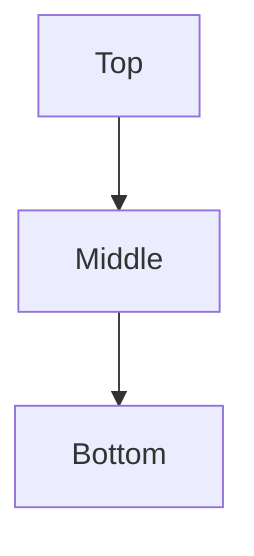
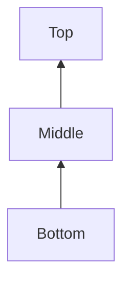

# Documentation - Mermaid - Flowcharts - Directions
[[Flowcharts]](./README.md) | [[Home]](/README.md)

You can specify different directions for your flowcharts:

## Top-Down (TD/TB)
This is the default direction. You can use either `TD` (top-down) or `TB` (top to bottom) - they're equivalent.

You can also omit the direction entirely for top-down flowcharts:

## Bottom-Up (BT)

## Left to Right (LR)

## Right to Left (RL)

