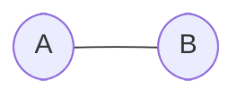

# Documentation - Mermaid - Flowcharts - Node Shapes
[[Flowcharts]](./README.md) | [[Home]](/README.md)

Flowcharts can have nodes with various shapes:

## Basic Shapes

### Rectangle

### Rounded Rectangle

### Circle

### Double Circle

## Special Purpose Shapes

### Stadium shape

### Subroutine

### Database

## Decision Shapes

### Diamond/Decision

### Hexagon

## Directional Shapes

### Asymmetric

### Parallelogram

### Parallelogram Alternative

### Trapezoid

### Trapezoid Alternative

